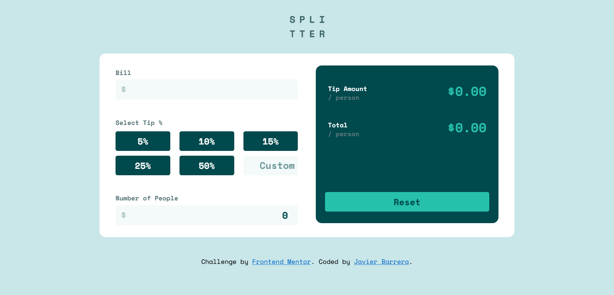

# Frontend Mentor - Tip calculator app solution

This is a solution to the [Tip calculator app challenge on Frontend Mentor](https://www.frontendmentor.io/challenges/tip-calculator-app-ugJNGbJUX). Frontend Mentor challenges help you improve your coding skills by building realistic projects.

## Table of contents

- [Overview](#overview)
  - [The challenge](#the-challenge)
  - [Screenshot](#screenshot)
  - [Links](#links)
- [My process](#my-process)
  - [Built with](#built-with)
  - [What I learned](#what-i-learned)
  - [Useful resources](#useful-resources)
- [Author](#author)

## Overview

### The challenge

Users should be able to:

- View the optimal layout for the app depending on their device's screen size
- See hover states for all interactive elements on the page
- Calculate the correct tip and total cost of the bill per person

### Screenshot

- Live Site URL:(https://tip-calculator-app-tau.vercel.app/)

## My process

### Built with

- Semantic HTML5 markup
- CSS custom properties
- Flexbox
- Mobile-first workflow
- JavaScript

### What I learned

Use this section to recap over some of your major learnings while working through this project. Writing these out and providing code samples of areas you want to highlight is a great way to reinforce your own knowledge.
I decided to try out using a mobile first workflow to try out something new when developing this project. While working I found it harder for me to style elements in a desktop view comming from mobile. While I did like the new experience
of working on a mobile first workflow, I prefer working desktop first.

### Useful resources

- [Format Currency](https://www.samanthaming.com/tidbits/30-how-to-format-currency-in-es6/) - This helped me learn how to properly format currencies and other styles that I will use in future projects.

## Author

- Github - [Javier Barrera](https://github.com/javierb256)

